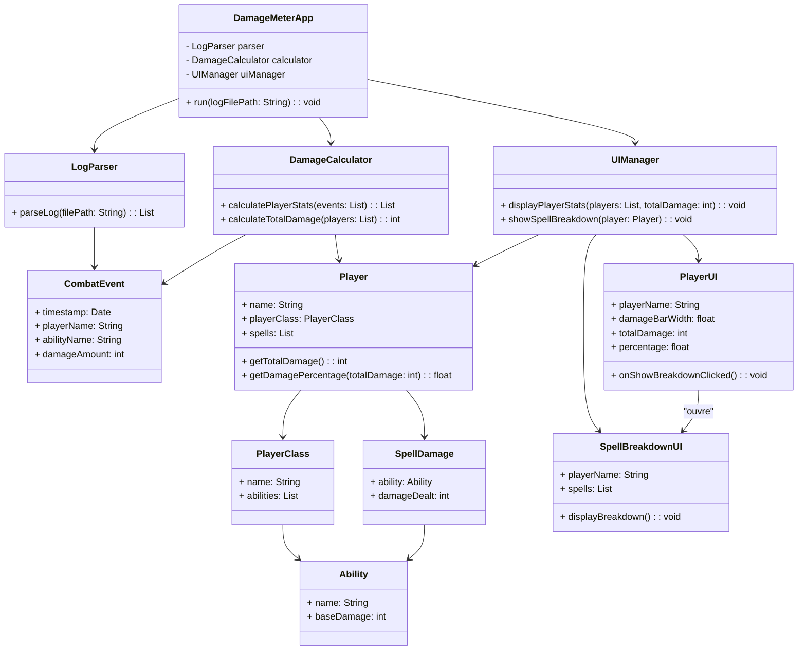

# 🧮 Damage Meter Application — UML Design

This document presents the **UML class diagram** and **sequence diagram** for a *Damage Meter* application.  
The app parses a combat log file, calculates per-player and per-ability damage, and displays it in a simple UI with breakdown functionality.

---

## 🧩 Class Diagram



```merdaid
sequenceDiagram
participant User as Utilisateur
participant App as DamageMeterApp
participant Parser as LogParser
participant Calc as DamageCalculator
participant UI as UIManager
participant PlayerUI as PlayerUI
participant Breakdown as SpellBreakdownUI

%% === Phase 1 : Lancement du programme ===
User->>App: run("combat.log")
App->>Parser: parseLog("combat.log")
Parser-->>App: List<CombatEvent>

%% === Phase 2 : Calcul des statistiques ===
App->>Calc: calculatePlayerStats(events)
Calc-->>App: List<Player>
App->>Calc: calculateTotalDamage(players)
Calc-->>App: totalDamage

%% === Phase 3 : Affichage principal ===
App->>UI: displayPlayerStats(players, totalDamage)
UI->>PlayerUI: créer une ligne par joueur
PlayerUI-->>UI: lignes prêtes avec bouton "Breakdown"
UI-->>User: affiche la liste principale des joueurs

%% === Phase 4 : Interaction Breakdown ===
User->>PlayerUI: clic sur "Breakdown"
PlayerUI->>UI: onShowBreakdownClicked()
UI->>UI: showSpellBreakdown(player)
UI->>Breakdown: créer SpellBreakdownUI(player)
Breakdown->>Breakdown: displayBreakdown()
Breakdown-->>User: affiche la répartition des dégâts par sort

%% === Phase 5 : Fermeture Breakdown ===
User->>Breakdown: clic sur "Fermer"
Breakdown->>UI: onClose()
UI->>Breakdown: destroy() / hide()
UI->>UI: displayPlayerStats(players, totalDamage)
UI-->>User: retourne à la vue principale
```