# 🧮 WakMeter - Wakfu Damage Meter

WakMeter is a damage meter application for the game Wakfu. It parses combat log files in real-time, calculates per-player and per-ability damage, and displays statistics in a JavaFX-based user interface with detailed breakdown functionality.

## 🚀 Quick Start

### Download and Run

1. Download the latest `WakMeter.exe` from the releases page
2. Make sure you have Java 21 or higher installed
3. Double-click `WakMeter.exe` to run

### Building from Source

See [BUILD.md](BUILD.md) for detailed build instructions.

Quick build:
```bash
mvn clean package
```

This creates:
- `target/WakMeter-1.0.0-SNAPSHOT.jar` - Standalone JAR file
- `target/WakMeter.exe` - Windows executable

---

## 📐 UML Design

This section presents the **UML class diagram** and **sequence diagram** for the application architecture.  
The app parses a combat log file, calculates per-player and per-ability damage, and displays it in a simple UI with breakdown functionality.

---

## 🧩 Class Diagram

```mermaid
graph TD
    %% ====== SOURCES ET FLUX ======
    subgraph "🧩 Log Processing"
        A[📄 Fichier de log Wakfu] --> B[🔍 LogParser]
        B --> C[⚙️ LogProcessor]
        C --> D[🧠 EventProcessor]
    end

    subgraph "📊 Calculs et Modèle"
        D --> E[📘 FightModel]
        E --> F[📈 DamageCalculator]
    end

    subgraph "🎨 Interface Utilisateur (UI)"
        F --> G[🪟 UIManager]
        G --> H[📊 DamageBreakdownUI]
    end

    %% ====== RELATIONS INTERNES ======
    style A fill:#3a3a3a,stroke:#888,color:#fff
    style B fill:#6666ff,stroke:#222,color:#fff
    style C fill:#4a90e2,stroke:#333,color:#fff
    style D fill:#2c82c9,stroke:#333,color:#fff
    style E fill:#2ecc71,stroke:#333,color:#fff
    style F fill:#27ae60,stroke:#333,color:#fff
    style G fill:#f39c12,stroke:#333,color:#fff
    style H fill:#e67e22,stroke:#333,color:#fff

    %% ====== DÉTAILS DE FLUX ======
    %% WatchFile loop
    B -. lit en continu .-> A
    %% Event generation
    B -->|Ligne analysée| C
    C -->|Crée CombatEvent / BattleEvent| D
    D -->|Met à jour| E
    F -->|Calcule totaux + breakdown| E
    E -->|Expose stats| G
    G -->|Affiche joueurs| H

    %% ====== INTERACTIONS UI ======
    G -->|Bouton Reset / AutoReset| E
    G -->|Bouton Breakdown| H
```

